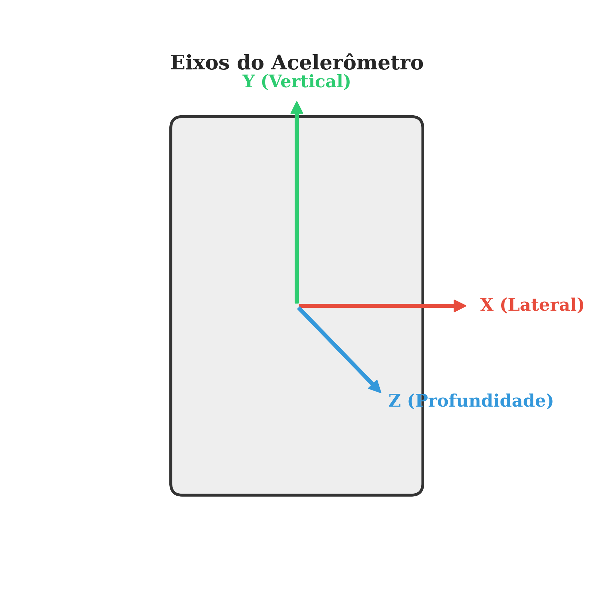
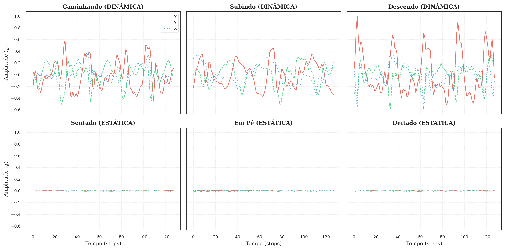
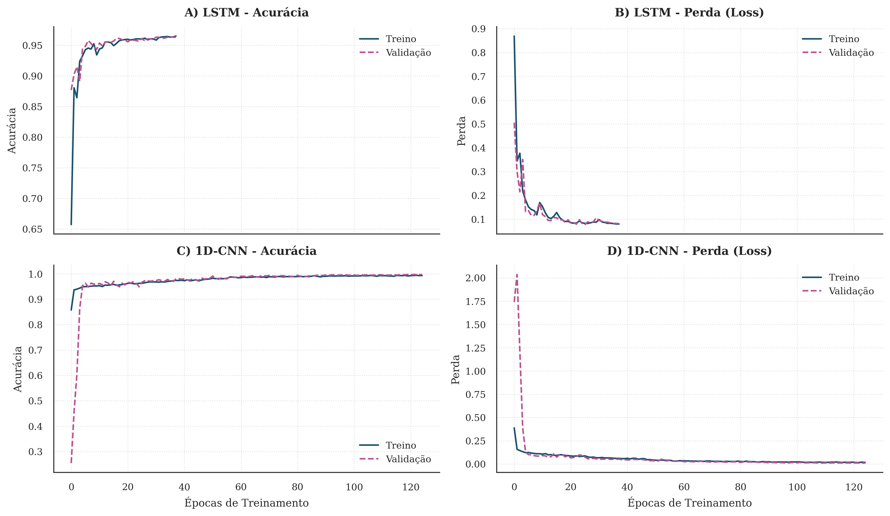
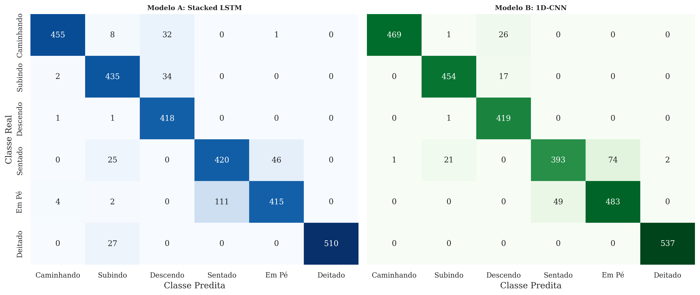

## Agenda

1.  Contextualização e Problemática
2.  Fundamentação Teórica e Dados
3.  Metodologia e Arquiteturas (Detalhamento Matemático)
4.  Análise de Resultados
5.  Conclusão e Trabalhos Futuros

---

# 1. Introdução

## O Problema: HAR (*Human Activity Recognition*)

:::: {.columns}

::: {.column width="60%"}
**Contexto:**
A computação onipresente gera fluxos massivos de dados inerciais (*Smartphones*, *Smartwatches*).

**O Desafio:**
Classificar atividades complexas a partir de séries temporais ruidosas e estocásticas.

. . .

**Abordagem Proposta:**
Substituir a *Feature Engineering* manual clássica por **Deep Learning End-to-End**.

::: {.callout-important}
## Objetivo
Comparar rigorosamente o desempenho de redes **Recorrentes (LSTM)** vs. **Convolucionais (1D-CNN)** no dataset UCI HAR.
:::
:::

::: {.column width="40%"}

**Figura 1: Eixos do Sensor**

::: {.r-stack}
{width="90%"}
:::

<small>Fonte: Adaptado de Anguita et al. (2013).</small>

:::

::::

# 2. Dados e Pré-processamento

## O Dataset UCI HAR

* **Amostra:** 30 voluntários (19-48 anos).
* **Sensor:** Samsung Galaxy S II (Cintura).
* **Frequência de Amostragem:** 50Hz (50 leituras por segundo).

### Distribuição das Classes (Balanceamento)

---

**Figura 2: Contagem de Amostras por Classe**

::: {.r-stretch}
{width="100%" fig-align="center"}
:::

<small>Fonte: Elaborada pelo autor.</small>

---

## Análise Temporal dos Sinais ($X_{body}$)

---

**Figura 3: Comparativo de Sinais Brutos (Janela 2.56s)**

::: {.r-stretch}
{width="100%" fig-align="center"}
:::

<small>Legenda: Eixos X (Sólido), Y (Tracejado), Z (Pontilhado). Fonte: Elaborada pelo autor.</small>

---

## Estrutura do Tensor de Entrada ($X$)

Para alimentar as redes neurais, os dados foram estruturados em janelas deslizantes.

$$X \in \mathbb{R}^{N \times 128 \times 9}$$

:::: {.columns}

::: {.column width="50%"}
**1. Dimensão Temporal (Time Steps):**
* Frequência: **50Hz**.
* Tamanho da Janela: **128 passos**.
* Duração Física: $\frac{128}{50} = \mathbf{2.56 \text{ segundos}}$.
* **Overlap (50%):** A janela desliza a cada 64 passos para manter a continuidade do movimento.
:::

::: {.column width="50%"}
**2. Dimensão de Features (Canais):**
As 9 variáveis de entrada ($X_t$):
1.  **Aceleração Corporal** ($x, y, z$)
2.  **Aceleração Total** ($x, y, z$) $\rightarrow$ Inclui Gravidade!
3.  **Giroscópio** ($x, y, z$)
:::

::::

## Tratamento do Target ($Y$)

Utilizamos **One-Hot Encoding** para todas as 6 classes, evitando ordinalidade numérica.

**Tabela 1: Mapeamento de Classes**

| ID | Atividade | Vetor One-Hot (Target) |
|:---:|:---|:---:|
| 1 | **Caminhando** | `[1, 0, 0, 0, 0, 0]` |
| 2 | **Subindo Escadas** | `[0, 1, 0, 0, 0, 0]` |
| 3 | **Descendo Escadas**| `[0, 0, 1, 0, 0, 0]` |
| 4 | **Sentado** | `[0, 0, 0, 1, 0, 0]` |
| 5 | **Em Pé** | `[0, 0, 0, 0, 1, 0]` |
| 6 | **Deitado** | `[0, 0, 0, 0, 0, 1]` |

<small>Fonte: Elaborada pelo autor.</small>

# 3. Modelagem Computacional

## Probabilidade de Classe: Softmax

A camada final utiliza a função **Softmax** para converter os *logits* (saídas brutas) em uma distribuição de probabilidade válida.

$$P(y=i|x) = \sigma(z)_i = \frac{e^{z_i}}{\sum_{j=1}^{K} e^{z_j}}$$

**Detalhamento dos Termos:**
* **$z_i$**: *Logit* (score linear) gerado pelo neurônio da classe $i$. Quanto maior, mais provável a classe.
* **$e^{z_i}$**: Exponencial natural. Garante que todos os valores sejam positivos e penaliza valores baixos.
* **$\sum$ (Denominador)**: Soma de todas as exponenciais. Atua como fator de normalização para que $\sum P(y) = 1$.
* **$K$**: Número total de classes ($K=6$).

**Decisão Final:**
$$\hat{y} = \text{argmax}(\sigma(z))$$

## Fundamentação Matemática: LSTM

A **Long Short-Term Memory** processa a sequência temporal passo a passo ($t=1 \dots 128$), mantendo uma memória de longo prazo.

:::: {.columns}
::: {.column width="50%"}
**Equações dos Portões:**
1.  **Esquecimento ($f_t$):** *O que descartar da memória antiga?*
    $$f_t = \sigma(W_f \cdot [h_{t-1}, x_t] + b_f)$$
2.  **Entrada ($i_t$):** *O que adicionar de novo?*
    $$i_t = \sigma(W_i \cdot [h_{t-1}, x_t] + b_i)$$
:::
::: {.column width="50%"}
**Variáveis:**
* **$x_t$**: Vetor de entrada no tempo $t$ (dimensão 9).
* **$h_{t-1}$**: Estado oculto (saída) do passo anterior.
* **$W, b$**: Pesos e vieses aprendidos pela rede.
* **$\sigma$**: Função Sigmoide (retorna valor entre 0 e 1).
:::
::::

## Fundamentação Matemática: 1D-CNN

A **Convolutional Neural Network 1D** utiliza filtros deslizantes para detectar padrões locais (como um pico de aceleração súbito).

**Operação de Convolução Discreta:**
$$y[t] = (x * w)[t] = \sum_{k=0}^{K-1} x[t+k] \cdot w[k] + b$$

**Detalhamento dos Termos:**
* **$x$**: Janela de entrada (sinal temporal).
* **$w$**: Kernel (Filtro) de tamanho $K$ (ex: $K=3$). É aqui que a rede aprende a "forma" do movimento.
* **$t$**: Posição temporal onde o filtro está sendo aplicado.
* **$b$**: Viés (bias) do filtro.

**Vantagem:** Invariância à translação (detecta o passo independente de quando ele ocorre na janela).

[Image of 1D Convolutional Neural Network structure]

## Arquiteturas Propostas

::: {.panel-tabset}

### A. Stacked LSTM

**Foco:** Dependência Temporal Longa.

* **Camada 1:** LSTM (128 units, `return_sequences=True`)
* **Camada 2:** LSTM (64 units)
* **Regularização:** Dropout (0.3) + BatchNormalization
* **Parâmetros Totais:** ~124.870

### B. Pure 1D-CNN

**Foco:** Padrões Locais e Invariância.

* **Bloco 1:** Conv1D (64 filtros) + MaxPool
* **Bloco 2:** Conv1D (128 filtros) + MaxPool
* **Bloco 3:** Conv1D (256 filtros) + MaxPool
* **Pooling Final:** Global Average Pooling (GAP)
* **Parâmetros Totais:** ~143.686

:::

## Hiperparâmetros de Treinamento

**Tabela 2: Configuração Experimental**

| Parâmetro | Configuração | Justificativa |
|:---|:---|:---|
| **Otimizador** | Adam | Momento Adaptativo para convergência rápida. |
| **Learning Rate** | 0.001 | Padrão inicial, ajustado dinamicamente. |
| **Inicialização** | He Normal | Ideal para função de ativação ReLU. |
| **Scheduler** | `ReduceLROnPlateau` | Ajuste fino (*fine-tuning*) em mínimos locais. |
| **Critério Parada** | `EarlyStopping` | Monitoramento da *Val Loss* (Patience=12). |

<small>Fonte: Elaborada pelo autor.</small>

# 4. Resultados Experimentais

## Dinâmica de Treinamento

---

**Figura 4: Histórico de Convergência (Acurácia e Perda)**

::: {.r-stretch}
{width="100%" fig-align="center"}
:::

<small>Legenda: (A-B) LSTM; (C-D) CNN. Linha Sólida: Treino; Tracejada: Validação. Fonte: Elaborada pelo autor.</small>

---

## Métricas Finais (Conjunto de Teste)

Avaliação em **2.947 amostras** independentes.

**Tabela 3: Comparativo de Desempenho**

| Métrica | Stacked LSTM | Pure 1D-CNN |
|:---|:---:|:---:|
| **Acurácia Global** | 90% | **93%** |
| **Precision (Média)** | 0.90 | **0.94** |
| **F1-Score (Média)** | 0.90 | **0.93** |

::: {.fragment .fade-up}
::: {.callout-tip}
## Veredito
A **1D-CNN** é superior tanto em acurácia quanto em eficiência computacional para janelas curtas (2.56s).
:::
:::

## Análise de Erros: A Matriz de Confusão

---

**Figura 5: Matrizes de Confusão Normalizadas**

::: {.r-stretch}
{width="90%" fig-align="center"}
:::

<small>Legenda: Esquerda (LSTM), Direita (CNN). Fonte: Elaborada pelo autor.</small>

# 5. Conclusão

## Considerações Finais

1.  **Eficácia do Deep Learning:** Ambas as arquiteturas eliminaram a necessidade de *feature engineering* manual, superando 90% de acurácia global.
2.  **Superioridade na Classe "Deitado":** A **1D-CNN** atingiu **100% de acurácia** nesta categoria. A capacidade de filtrar a forma da onda (morfologia) mostrou-se mais eficaz para isolar essa postura do que a memória sequencial.
3.  **Generalização (CNN vs. LSTM):** A LSTM apresentou indícios de **superajuste (*overfitting*)**: apesar do rápido decaimento da perda no treinamento, sua generalização nos dados de teste foi inferior, indicando memorização de ruído nas sequências.
4.  **Eficiência para Deploy:** A CNN oferece o melhor equilíbrio, sendo computacionalmente mais leve (paralelizável) e estatisticamente mais robusta.

## Referências Bibliográficas

* **Anguita, D. et al.** (2013). A Public Domain Dataset for HAR. *ESANN*.
* **Goodfellow, I. et al.** (2016). *Deep Learning*. MIT Press.
* **Hochreiter, S. & Schmidhuber, J.** (1997). Long Short-Term Memory.
* **Kiranyaz, S. et al.** (2021). 1D Convolutional Neural Networks: A Survey.

## 

::: {.r-fit-text}
**Obrigado!**
:::

ramon.tavares@ufpe.br

